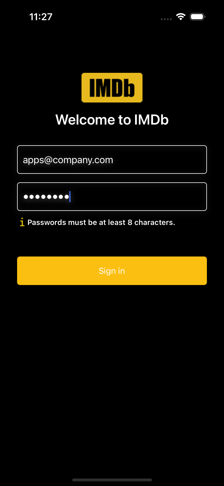
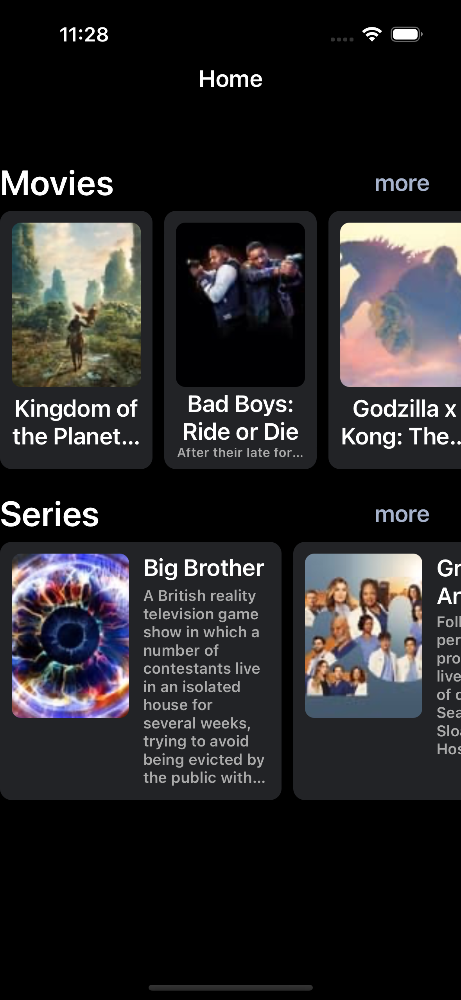
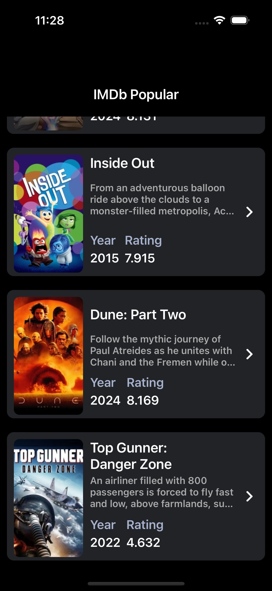
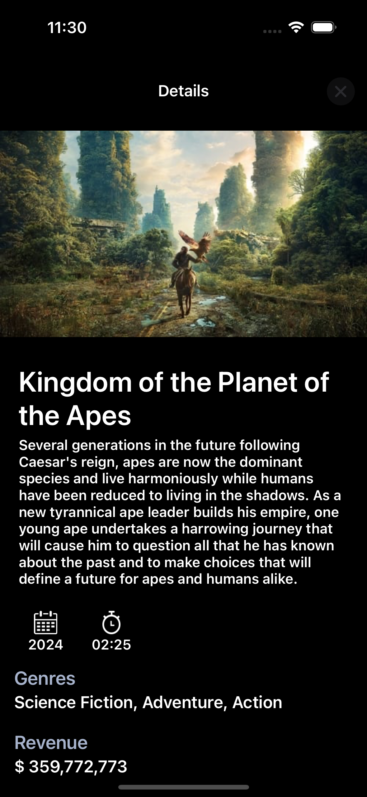

# IMDB App

## Overview

Welcome to the repository for IMDB App. This app is designed to provide users with List of popular movies. This is connected to IMDB API

## Features

- Log In screen  
- Dashboard Screen - contains Movies and Series binded to IMDB
 
- Popular Screen - could be series list or movie list, depends on User interaction binded to IMDB
 
- Movie/Series Details Screen - contains details of the selected Movie/Series binded to IMDB
 

## Technologies Used

- **Language**: Swift
- **Framework**: SwiftUI
- **Tools**: Xcode, Swift Package Manager
- **Design Pattern**: VIPER

## Installation

To get started with IMDB App, follow these steps:

1. **Clone the repository:**

   ```bash
   git clone git@github.com:nitrodamsel/Test-API-iOS-Application.git


## Project Structure

The project follows the VIPER (View, Interactor, Presenter, Entity, Router) architecture pattern to maintain a clean separation of concerns and enhance the testability and maintainability of the codebase. Here is a brief overview of the key components and their roles:

### Domain

- `VideoType`: Defines the types of videos (e.g., Movie, Series) used throughout the application.

### Flow - Application

- `ApplicationFlowCoordinator`: Manages the flow and navigation of the application from launch.

### Flow - Login

- **View**
  - `LoginView`: The UI component for the login screen.
  - `LoginViewController`: Handles the user interactions and updates the login view.
  - `LoginViewController+Build`: Contains the build configurations for the login view.
- **Interactor**
  - `LoginInteractor`: Contains the business logic related to the login process.
- **Presenter**
  - `LoginPresenter`: Prepares the data for display and communicates with the interactor.
- `LoginFlowCoordinator`: Coordinates the flow for the login process.

### Flow - HomePage

- **Model**
  - `VideoSectionViewModel`: The data model for the video sections displayed on the homepage.
- **View**
  - [Includes view components for the homepage]
- **Interactor**
  - [Includes interactor components for the homepage]
- **Presenter**
  - [Includes presenter components for the homepage]
- `HomePageFlowCoordinator`: Manages the navigation flow for the homepage.

### Flow - PopularList

- `PopularListViewController`: The main view controller for displaying popular movies and series.
- **Model**
  - [Includes model components for the popular list]
- **View**
  - [Includes view components for the popular list]
- **Interactor**
  - `PopularListInteractor`: Contains the business logic for fetching and processing the popular list.
- **Presenter**
  - `PopularListPresenter`: Prepares the popular list data for display and communicates with the interactor.
- `PopularListFlowCoordinator`: Coordinates the flow for the popular list screen.
- `DetailsViewController`: Displays the details of a selected movie or series.

### Root

- `IMDbApp`: The main application class.
- `AppDelegate`: Manages application-level events.


